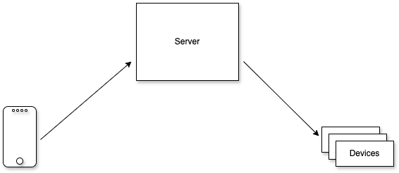

# lamps
some IOT lights and stuff

 
# Project Directory
| Name                                  | Purpose                                           | 
| :--                                   | :--                                               |
|[devices](electron)                    | Microcontroller code for all the devices          |
|[docs](docs)                           | More documentation & imgs                         |
|[server](services)                     | Serves Public API for controlling the stuff       |

